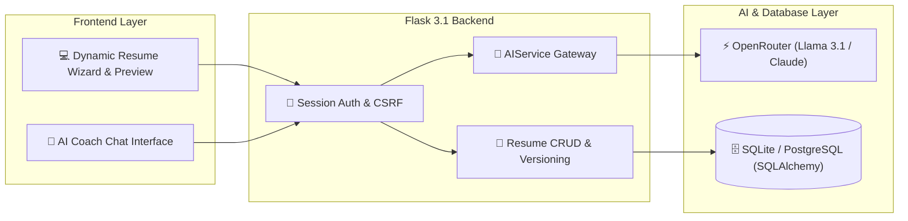

<div align="center">

# 📄 WISAXIS AI Resume Maker & ATS Optimization SaaS

<p align="center">
  
  
  
  
  
  
</p>

<p align="center">
  <b>Production-Grade AI Resume Builder with OpenRouter LLM Gateway, CAR Framework Bullet Generator, and Real-Time ATS Scorecard</b>
</p>

<p align="center">
  
</p>

</div>

---

## 🌟 Overview

**WISAXIS AI Resume Maker** is an AI-powered SaaS platform that streamlines the creation of professional, ATS-optimized resumes. Engineered using Python Flask and OpenRouter's multi-model AI gateway (Meta Llama 3.1 & Anthropic Claude), it automates summary generation, bullet point refinement, grammar polish, and ATS keyword matching with live previews and PDF exports.

---

## ✨ Key Features

- 🤖 **Multi-Model AI Engine (OpenRouter API):** Leverages OpenAI-compatible REST endpoints to switch seamlessly between free models (`llama-3.1-8b-instruct`) and high-tier reasoning models.
- 🎯 **CAR Framework Bullet Generator:** Transforms casual job descriptions into impactful bullets using the **Challenge → Action → Result** formula with quantifiable metrics.
- 📊 **Structured ATS Compatibility Scoring:** Evaluates resume content against algorithmic ATS parsers, outputting a 0–100 score, key strengths, and actionable improvement recommendations.
- 💬 **Interactive Career Coach AI:** Multi-turn contextual chat assistant equipped with career advisory prompts and conversational history truncation.
- 🎨 **Multi-Template Dynamic Previews:** Real-time resume rendering across multiple executive and modern layout templates.
- 📜 **Version History & Soft Deletes:** Snapshotting system archiving up to 20 past versions per resume with instant restore capabilities.

---

## 🏗️ System Architecture



---

## 📁 Project Structure

```
Resume-Maker/
├── backend/
│   ├── routes/              # Modular Blueprints (auth, resume, ai, main, api)
│   ├── services/            # Pure static AIService (prompts, rate limiting, error handling)
│   ├── models.py            # SQLAlchemy models (User, Resume, Experience, Version, AIHistory)
│   ├── config.py            # Development, Testing & Production configurations
│   └── extensions.py        # Extensions singleton initialization (DB, CSRF, Limiter)
├── frontend/
│   ├── templates/           # Jinja2 server-rendered templates (wizard, preview, chat)
│   └── static/              # CSS, JS modules, and template themes
├── app.py                   # Local development server entry point
├── requirements.txt         # Python dependencies
└── .env.example             # Environment variables template
```

---

## 🚀 Getting Started

### 1. Prerequisites
- Python 3.12+
- OpenRouter API Key ([openrouter.ai](https://openrouter.ai))

### 2. Installation
```bash
# Clone the repository
git clone https://github.com/ra901625072-boop/Resume-Maker.git
cd Resume-Maker

# Create and activate virtual environment
python -m venv venv
venv\Scripts\activate        # Linux/macOS: source venv/bin/activate

# Install dependencies
pip install -r requirements.txt
```

### 3. Environment Configuration
Create a `.env` file in the root directory:
```env
SECRET_KEY=your-secure-secret-key
OPENROUTER_API_KEY=your-openrouter-api-key
OPENROUTER_MODEL=meta-llama/llama-3.1-8b-instruct:free
FLASK_ENV=development
```

### 4. Run Application
```bash
python app.py
```
Open `http://localhost:5000` in your web browser.

---

## 👨‍💻 Author

**Akshaysinh Rajput**
- 🌐 Portfolio: [portfolioakshay.in](https://portfolioakshay.in)
- 💼 LinkedIn: [Akshaysinh Rajput](https://www.linkedin.com/in/akshaysinh-rajput-8a575532b/)
- 🐙 GitHub: [@ra901625072-boop](https://github.com/ra901625072-boop)